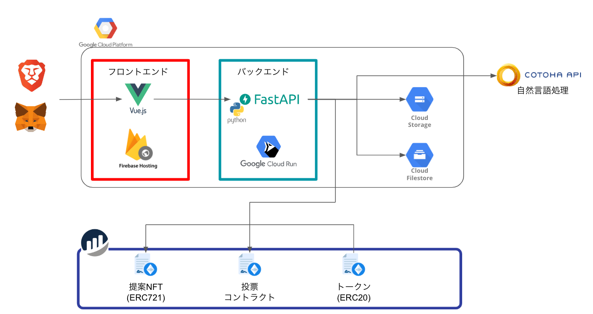

# innovation-support-server

イノベーションサポートの BE です。

イノサポのサービスには下記の URL からアクセスしてください

- ~[イノサポ - InnovationSupport](https://innovation-support-d391e.web.app)~ 公開は終了しました

<div align="center">
  
</div>

## 全体像

イノベーションサポートの全体像は下記の図の通りです。本リポジトリはそのうちの、緑枠の「バックエンド」のソースコードです。



その他のソースコードはそれぞれ、下記のリポジトリを確認してください

- 青枠 - スマートコントラクト
  - [GitHub - teritamas/innovation-support-smartcontract](https://github.com/teritamas/innovation-support-smartcontract)
- 赤枠 - フロントエンド
  - [GitHub - teritamas/innovation-support-frontend](https://github.com/teritamas/innovation-support-frontend)

## API ドキュメント

API の種類や仕様に関しては下記の URL を参照してください

- [DAO Innovation Support](https://innovation-support-server-fae3im6i6q-an.a.run.app/docs)

## Quick Start

はじめに`.env.sample`を参考に、本プロジェクト直下に`.env`のファイルを作成する。

```sh:.env.sample
# google cloudのサービスアカウントのキー
CRED_PATH=

# 提案NFTのコントラクトアドレス
PROPOSAL_NFT_CONTRACT_ADDRESS=
# トークンNFTのコントラクトアドレス
INOSAPO_FT_CONTRACT_ADDRESS=
# 投票コントラクトのコントラクトアドレス
PROPOSAL_VOTE_CONTRACT_ADDRESS=

# 本システムのウォレットの秘密鍵、存在しない場合は指定したパスに自動で生成される。
SYSTEM_WALLET_PRIVATE_KEY_PATH=./key/wallet/dev_private.key
# 上記のコントラクトをデプロイしたネットワーク名
PROVIDE_NETWORK=https://goerli.blockpi.network/v1/rpc/public

# Google Cloud Storageに提案のPDFとサムネイルを保存する場合のルートパス
GOOGLE_CLOUD_STORAGE_BUCKET_NAME=proposal-for-innovation-support

# フロントエンドのURL
FRONTEND_URL=

# Slack通知を利用する場合、通知先のSlackのIncoming WebhooksのURL
DEFAULT_SLACK_INCOMING_WEBHOOKS_URL=

# COTOHA APIの接続に必要な情報.　設定されていない場合は利用されない
COTOHA_CLIENT_ID=
COTOHA_CLIENT_SECRET=

# バッチ処理の実行間隔
BATCH_INTERVAL_MINUTE=1

# デプロイしたコントラクトのブロックエクスプローラーのURL
BLOCK_EXPLORER_URL=https://goerli.etherscan.io/
```

その後下記のコマンドを実行し、必要ライブラリのインストールと単体テストを行う。

```sh:
poetry install
poetry run pytest .
```

APIサーバーを起動する。

```sh:
poetry run uvicorn app.main:app --host 0.0.0.0 --port 8000 --reload
```

実行後下記の URL に SwaggerDoc が表示される

- http://localhost:8000/docs


## その他スクリプト

### Docker による起動

ローカルに Python 環境を構築することなく、Docker 上で起動することができる。

```sh:
docker-compose up -d
```

### テストユーザを作成し投票

動作確認やデモ用に、指定した提案に対して、下記の処理を行う。
- サンプルユーザによる投票処理
- 指定した提案の投票期間の終了

```sh:
poetry run python scripts/sample_vote.py -h
usage: sample_vote.py [-h] [--proposal_id PROPOSAL_ID] [--voter_count VOTER_COUNT]
                      [--agreement_rate AGREEMENT_RATE]

options:
  -h, --help            show this help message and exit
  --proposal_id PROPOSAL_ID
                        投票対象の提案ID
  --voter_count VOTER_COUNT
                        投票数
  --agreement_rate AGREEMENT_RATE
                        賛成の割合
```

例えば、`test_proposal_id`に賛成比率を 7 割で 200 票投票する場合は、下記のコマンドを実行する。

```sh:
poetry run python scripts/sample_vote.py --proposal_id=test_proposal_id --voter_count=200 --agreement_rate=0.7
```
